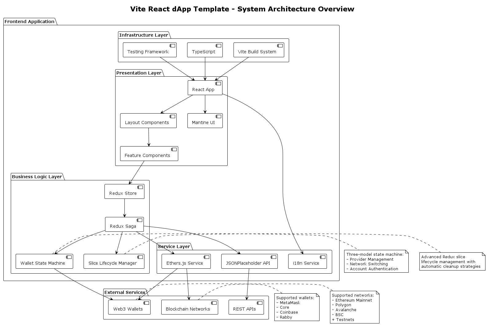
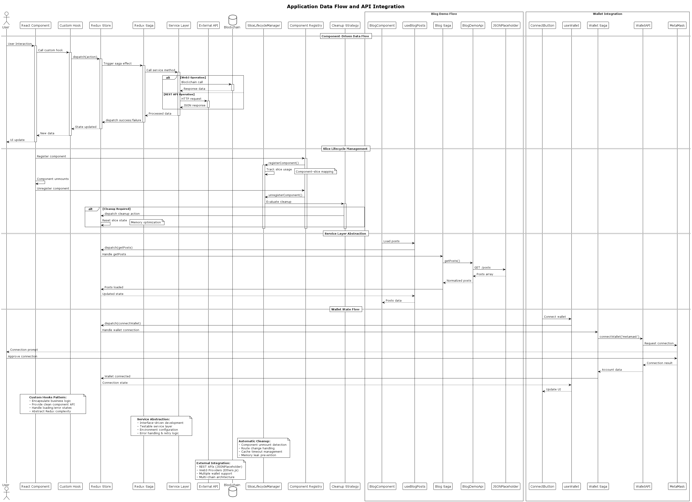

# React dApp Template (Vite)


 
   

A sophisticated, production-ready React template specifically designed for decentralized application (dApp) frontend development with modern Web3 integration.

🚀 **[Live Demo](https://snazzy-sorbet-15dcef.netlify.app)** | 📚 **[Documentation](https://huseyindeniz.github.io/react-dapp-template-documentation/)**

## Quick Start

```bash
npx degit huseyindeniz/vite-react-dapp-template my-dapp
cd my-dapp
npm install
npm run dev
```

> **⚠️ UI Library Migration Notice:**  
> Starting from **v0.7.0**, this template uses **Mantine** as the UI library. Previous versions used Chakra UI.

## Why Choose This Template?

### 🎯 **Built for Web3**

- **Multi-Wallet Support**: MetaMask, Core, Coinbase, Rabby with extensible architecture
- **Multi-Chain Ready**: Ethereum, Polygon, Avalanche, BSC + all major testnets
- **Advanced Web3 State Management**: Sophisticated three-model wallet system (Provider, Network, Account)

### ⚡ **Modern Development Experience**

- **Latest React 19**: Concurrent features, improved Suspense, optimized rendering
- **Vite 7**: Lightning-fast development and optimized production builds
- **TypeScript 5**: Full type safety with advanced features
- **Feature-Based Architecture**: Scalable organization by business domains

### 🧠 **Advanced State Management**

- **Redux Toolkit + Redux Saga**: Predictable state with complex async workflows
- **Slice Lifecycle Management**: Automatic cleanup strategies for optimal memory usage
- **Feature-Based Slices**: Organized by business domains rather than technical layers

### 🎨 **Modern UI/UX**

- **Mantine v8**: Comprehensive component library with excellent TypeScript support
- **Responsive Design**: Mobile-first approach with flexible layouts
- **Dark/Light Mode**: Built-in theme switching capabilities
- **Accessibility**: ARIA compliant components out of the box

## Core Features

### 🔐 **Web3 Wallet Integration**

- **Multi-Wallet Support**: [MetaMask](https://metamask.io), [Core](https://core.app), [Coinbase](https://www.coinbase.com), [Rabby](https://www.rabby.io)
- **Multi-Chain Support**: Ethereum, Polygon, Avalanche, BSC + testnets
- **Domain Name Support**: [AVVY Domains](https://avvy.domains) and ENS integration

### 🌍 **Internationalization (i18n)**

- **Multi-Language Support**: English, Turkish (easily extensible)
- **Browser Detection**: Automatic language detection
- **Namespace Organization**: Feature-based translation keys

### 🚦 **Routing & Navigation**

- **React Router v7**: Latest routing with improved performance
- **Protected Routes**: Wallet-based authentication guards
- **Lazy Loading**: Route-based code splitting for optimal performance
- **SEO Optimization**: Server-side rendering ready

### 🧪 **Comprehensive Testing**

- **Unit Tests**: Vitest with 30% coverage threshold
- **Component Tests**: React Testing Library integration
- **Visual Testing**: Storybook with multiple addons
- **E2E Testing**: Cypress + Synpress setup (ready to implement)

## Technology Stack

### **Core Technologies**

| Technology        | Version | Purpose                              |
| ----------------- | ------- | ------------------------------------ |
| **React**         | ^19.1.1 | UI framework with latest features    |
| **TypeScript**    | ^5.9.2  | Type safety and developer experience |
| **Vite**          | ^7.1.3  | Build tool and development server    |
| **Mantine**       | ^8.2.7  | UI component library                 |
| **Redux Toolkit** | ^2.8.2  | State management                     |
| **Redux Saga**    | ^1.3.0  | Async side effects                   |
| **React Router**  | ^7.8.2  | Client-side routing                  |
| **Ethers.js**     | ^6.15.0 | Web3/blockchain integration          |
| **i18next**       | ^25.4.2 | Internationalization                 |
| **Vitest**        | ^3.2.4  | Testing framework                    |
| **Storybook**     | ^8.6.14 | Component documentation              |

### **Advanced Features**

#### **Slice Lifecycle Manager**

Automatic Redux slice cleanup with multiple strategies:

- **Component**: Cleanup when components unmount
- **Route**: Cleanup when leaving routes
- **Cached**: Time-based cleanup with configurable timeout
- **Persistent**: Never cleanup automatically
- **Manual**: Only cleanup when explicitly triggered

#### **Web3 State Machine**

Sophisticated three-model architecture:

- **Provider Model**: Wallet detection and connection
- **Network Model**: Chain switching and validation
- **Account Model**: User authentication and signing

#### **Service Layer Abstraction**

Interface-driven architecture for external integrations:

- **Ethers.js Service**: Blockchain interaction abstraction
- **JSONPlaceholder Demo**: REST API integration example
- **Extensible Design**: Easy to add new services

## Architecture Overview



The template follows a **feature-based architecture** with clear separation of concerns:

### **📁 Project Structure**

```
src/
├── features/           # Feature-based organization
│   ├── app/           # Application bootstrap & providers
│   ├── wallet/        # Web3 wallet integration
│   ├── ui/            # Mantine-based design system
│   ├── router/        # Routing configuration
│   ├── i18n/          # Internationalization
│   ├── slice-manager/ # Redux lifecycle management
│   └── blog-demo/     # Complete feature example
├── pages/             # Application pages
├── services/          # External API integrations
├── store/             # Redux store configuration
└── hooks/             # Custom React hooks
```

### **🔄 Data Flow**



1. **UI Layer**: React components with Mantine design system
2. **State Layer**: Redux Toolkit with automatic slice management
3. **Service Layer**: Ethers.js and REST API abstractions
4. **External**: Blockchain networks and REST APIs

## Development Commands

### **Core Commands**

```bash
npm run dev          # Development server with HMR
npm run build        # Production build (TypeScript + Vite)
npm run test         # Unit tests with Vitest
npm run lint         # ESLint with zero warnings tolerance
npm run coverage     # Test coverage report
npm run preview      # Preview production build
```

### **Storybook**

```bash
npm run storybook         # Component development environment
npm run build-storybook   # Build static Storybook
```

### **Internationalization**

```bash
npm run extract             # Extract translation keys
npm run check-translations  # Validate translations
```

### **Release**

```bash
npm run release      # Version bump and release
npm run prepare      # Setup git hooks
```

## Configuration

### **Environment Variables**

```bash
# Wallet Configuration
VITE_WALLET_SIGN_TIMEOUT_IN_SEC=60
VITE_WALLET_DISABLE_SIGN=false
VITE_WALLET_POST_LOGIN_REDIRECT_PATH=/dashboard

# Router Configuration
VITE_ROUTER_USE_HASH=false

# Performance
VITE_WALLET_SLOW_DOWN_IN_MS=500
```

### **Supported Networks**

```typescript
// Pre-configured networks
SUPPORTED_NETWORKS = [
  AvalancheChain,
  BinanceSmartChain,
  PolygonChain,
  EthereumMainnetChain,
  // + All major testnets
];
```

### **TypeScript Path Aliases**

```typescript
"paths": {
  "@/features/*": ["./src/features/*"],
  "@/services/*": ["./src/services/*"],
  "@/pages/*": ["./src/pages/*"],
  "@/hooks/*": ["./src/hooks/*"],
  "@/store/*": ["./src/store/*"]
}
```

## Performance & Optimization

### **Bundle Optimization**

- ✅ **Manual Chunking**: Strategic code splitting
- ✅ **Tree Shaking**: Dead code elimination
- ✅ **Lazy Loading**: Route-based dynamic imports
- ✅ **Memory Management**: Automatic Redux cleanup

### **Build Output**

```
📦 Optimized Chunks:
├── ethers.js      (~255KB) - Web3 functionality
├── mantine.js     (~250KB) - UI components
├── router.js      (~200KB) - Routing logic
├── rtk.js         (~23KB)  - State management
└── app.js         (~166KB) - Application code
```

## Documentation

### **📚 Comprehensive Documentation**

- **[Official Documentation](https://huseyindeniz.github.io/react-dapp-template-documentation/)**: Complete setup guide
- **[Architecture Report](docs/architecture/ARCHITECTURE_REPORT.md)**: Detailed technical documentation
- **[Technology Stack](docs/architecture/TECH_STACK.md)**: Technology analysis and recommendations
- **[Dependencies](docs/architecture/DEPENDENCIES.md)**: Dependency management guide

### **🎨 Visual Documentation**

- **[System Overview](docs/architecture/diagrams/system-overview.png)**: High-level architecture
- **[Component Hierarchy](docs/architecture/diagrams/component-hierarchy.png)**: UI component structure
- **[Wallet State Flow](docs/architecture/diagrams/wallet-state-flow.png)**: Web3 state management
- **[Redux Architecture](docs/architecture/diagrams/redux-architecture.png)**: State management flow

## Alternative Versions

- **[Create React App Version](https://github.com/huseyindeniz/cra-template-dapp)**: CRA-based template
- **Legacy Versions**: v0.6.x and earlier used Chakra UI

## Contributing

We welcome contributions from the community!

### **How to Contribute**

- 💬 **Discussions**: [GitHub Discussions](https://github.com/huseyindeniz/vite-react-dapp-template/discussions) for suggestions
- 🐛 **Bug Reports**: [GitHub Issues](https://github.com/huseyindeniz/vite-react-dapp-template/issues)
- 🔧 **Pull Requests**: [GitHub PRs](https://github.com/huseyindeniz/vite-react-dapp-template/pulls)

### **Development Setup**

```bash
git clone https://github.com/huseyindeniz/vite-react-dapp-template.git
cd vite-react-dapp-template
npm install
npm run dev
```

## License

This project is licensed under the [MIT License](./LICENSE).

---

**🚀 Ready to build the next generation of decentralized applications?**

[Get Started Now](https://huseyindeniz.github.io/react-dapp-template-documentation/) | [View Live Demo](https://snazzy-sorbet-15dcef.netlify.app) | [Star on GitHub ⭐](https://github.com/huseyindeniz/vite-react-dapp-template)
