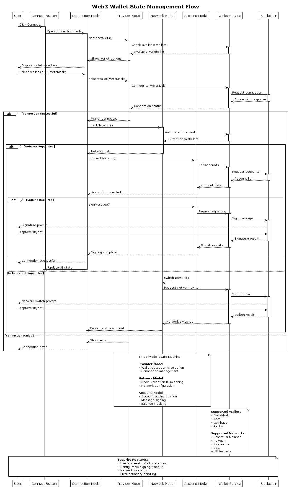
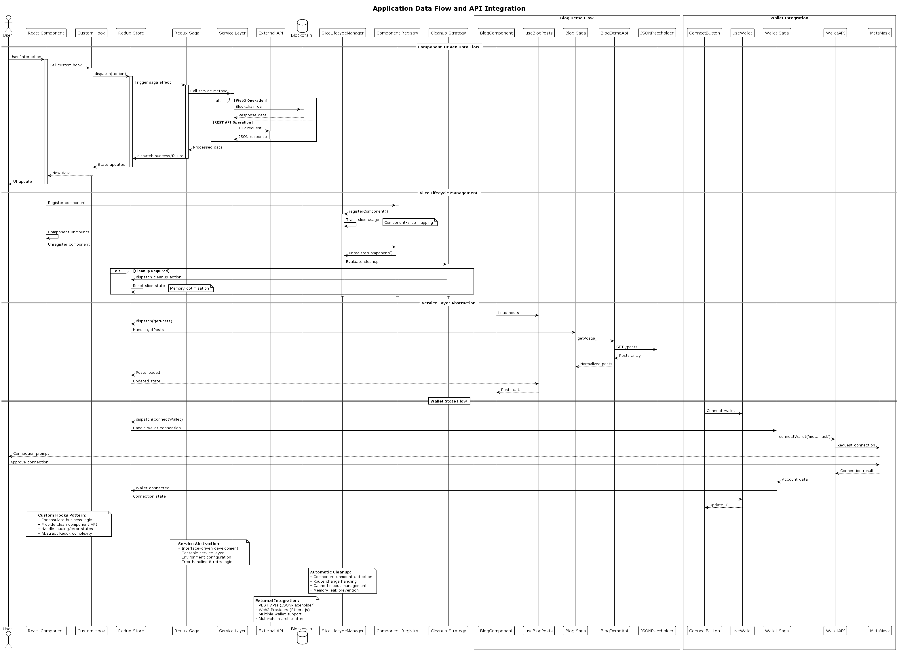

# Vite React dApp Template - Architecture Report v0.8.3

**Generated:** August 30, 2025  
**Version:** 0.8.3  
**Template:** React dApp Template for Web3/Blockchain Applications

## Executive Summary

The Vite React dApp Template is a sophisticated, production-ready template for building decentralized applications (dApps) with modern React architecture. The template emphasizes developer experience, type safety, and maintainable code structure while providing comprehensive Web3 integration capabilities.

### Key Architectural Decisions

- **Feature-Based Architecture**: Organized by business domains rather than technical layers
- **Advanced State Management**: Redux Toolkit with Redux Saga for complex async operations
- **Sophisticated Slice Lifecycle Management**: Automatic cleanup strategies for optimal memory usage
- **Multi-Wallet Web3 Integration**: Supports MetaMask, Core, Coinbase, and Rabby wallets
- **Multi-Chain Support**: Ethereum, Polygon, Avalanche, BSC with testnet support
- **Component-Driven Development**: Storybook integration with comprehensive testing

### Technology Stack Summary

| Category                 | Technology                 | Version         | Purpose                                                   |
| ------------------------ | -------------------------- | --------------- | --------------------------------------------------------- |
| **Build Tool**           | Vite                       | ^7.1.3          | Fast development and optimized production builds          |
| **UI Framework**         | React                      | ^19.1.1         | Component-based UI with latest features                   |
| **UI Library**           | Mantine                    | ^8.2.7          | Modern component library (migrated from Chakra UI v0.7.0) |
| **State Management**     | Redux Toolkit + Redux Saga | ^2.8.2 + ^1.3.0 | Predictable state with complex async flows                |
| **Routing**              | React Router DOM           | ^7.8.2          | Client-side routing with lazy loading                     |
| **Web3 Integration**     | Ethers.js                  | ^6.15.0         | Blockchain interaction and wallet integration             |
| **Testing**              | Vitest + RTL + Storybook   | ^3.2.4          | Unit, integration, and visual testing                     |
| **Internationalization** | i18next                    | ^25.4.2         | Multi-language support with browser detection             |
| **TypeScript**           | TypeScript                 | ^5.9.2          | Type safety and developer experience                      |

## System Architecture Overview


The application follows a layered architecture with clear separation of concerns:

### Architecture Layers

1. **Presentation Layer** (React Components)
   - Mantine-based UI components
   - Feature-specific component libraries
   - Layout and navigation components

2. **Business Logic Layer** (Redux + Saga)
   - Feature-specific Redux slices
   - Saga orchestration for complex workflows
   - Web3 wallet state management

3. **Service Layer** (API Integration)
   - Ethers.js Web3 service abstraction
   - JSONPlaceholder demo integration
   - External service interfaces

4. **Infrastructure Layer**
   - Vite build configuration
   - Testing utilities and mocks
   - Development tooling

## Feature Architecture


The codebase is organized around six main features:

### Core Features

#### 1. App Feature (`src/features/app/`)

- **Purpose**: Application bootstrap and provider composition
- **Key Components**: `App.tsx`, `composeContextProviders.tsx`
- **Responsibilities**: Provider orchestration, global configuration

#### 2. Wallet Feature (`src/features/wallet/`)

- **Purpose**: Web3 wallet integration and blockchain interaction
- **Architecture**: Three-model state machine (Provider, Network, Account)
- **Supported Wallets**: MetaMask, Core, Coinbase, Rabby
- **Supported Networks**: Ethereum, Polygon, Avalanche, BSC (+ testnets)

#### 3. UI Feature (`src/features/ui/`)

- **Purpose**: Design system and reusable components
- **Framework**: Mantine v8 (migrated from Chakra UI)
- **Components**: Layout, navigation, forms, modals, theme management

#### 4. Router Feature (`src/features/router/`)

- **Purpose**: Application routing and navigation
- **Technology**: React Router DOM v7
- **Features**: Lazy loading, protected routes, route-based code splitting

#### 5. i18n Feature (`src/features/i18n/`)

- **Purpose**: Internationalization and localization
- **Technology**: i18next with React integration
- **Supported Languages**: English (en-US), Turkish (tr-TR)
- **Features**: Browser language detection, namespace organization

#### 6. Slice Manager Feature (`src/features/slice-manager/`)

- **Purpose**: Advanced Redux slice lifecycle management
- **Key Innovation**: Automatic cleanup strategies for memory optimization
- **Strategies**: Component-based, route-based, cached, persistent, manual

### Demo Features

#### Blog Demo Feature (`src/features/blog-demo/`)

- **Purpose**: Demonstrates complete feature architecture
- **Models**: Posts, Authors, Categories, Comments, Blog Settings
- **Integration**: JSONPlaceholder API service
- **Architecture Pattern**: Redux slice per model with saga orchestration

## Web3 Wallet Integration



The wallet integration uses a sophisticated three-model state machine:

### Wallet Models

#### 1. Provider Model

- **Purpose**: Manages wallet detection and connection
- **State**: Available wallets, selected wallet, connection status
- **Actions**: `detectWallets`, `selectWallet`, `connectWallet`

#### 2. Network Model

- **Purpose**: Handles blockchain network management
- **State**: Supported networks, current network, switch requests
- **Actions**: `switchNetwork`, `addNetwork`, `validateNetwork`

#### 3. Account Model

- **Purpose**: Manages user authentication and signing
- **State**: Connected accounts, balances, signing status
- **Actions**: `connectAccount`, `signMessage`, `getBalance`

### Wallet Configuration

```typescript
// Supported Networks
SUPPORTED_NETWORKS = [
  AvalancheChain,
  BinanceSmartChain,
  PolygonChain,
  EthereumMainnetChain,
  AvalancheTestChain,
  BSCTestChain,
  PolygonMumbaiChain,
  GoerliTestChain,
  GanacheChain,
  SepoliaChain,
  HardhatChain,
];

// Supported Wallets
SUPPORTED_WALLETS = [Metamask, Core, Coinbase, Rabby];
```

## Redux Store Architecture


### Store Structure

```typescript
RootState = {
  wallet: {
    provider: ProviderState,
    network: NetworkState,
    account: AccountState,
  },
  blogDemo: {
    posts: PostsState,
    authors: AuthorsState,
    // ... other models
  },
};
```

### Slice Lifecycle Management

The `SliceLifecycleManager` provides advanced Redux slice management:

#### Cleanup Strategies

1. **Component Strategy**: Cleanup when components unmount
2. **Route Strategy**: Cleanup when leaving routes
3. **Cached Strategy**: Time-based cleanup with configurable timeout
4. **Persistent Strategy**: Never cleanup automatically
5. **Manual Strategy**: Only cleanup when explicitly triggered

#### Configuration Example

```typescript
const blogSliceConfig: SliceConfig = {
  name: 'posts',
  feature: 'blogDemo',
  cleanupStrategy: 'cached',
  cacheTimeout: 600000, // 10 minutes
  cleanupDelay: 3000, // 3 second delay
};
```

## Component Hierarchy and Routing


### Application Structure

```
App
├── ComposedProviders (Redux + Mantine + i18n)
└── Router
    ├── Layout
    │   ├── Header (MainMenu, ProfileDropdown, ColorSchemeSwitch)
    │   ├── Sidebar (SecondaryMenu, LanguageMenu)
    │   └── Main Content Area
    └── Routes
        ├── / → HomePage (index route)
        ├── /user → UserPage (protected)
        ├── /page1 → Page1
        ├── /page2 → Page2 (protected)
        ├── /blog → BlogPage
        └── /blog/:postId → BlogPostPage
```

### Route Configuration

Routes are defined with metadata for menu generation:

```typescript
type PageType = {
  path?: string;
  index?: boolean;
  element: React.ReactElement;
  menuLabel: string;
  isShownInMainMenu: boolean;
  isShownInSecondaryMenu: boolean;
  isProtected: boolean;
};
```

## Data Flow and API Integration



### API Integration Patterns

#### 1. Service Layer Abstraction

```typescript
interface IApi {
  // Generic API interface
}

interface IBlogDemoApi extends IApi {
  getPosts(params: GetPostsParams): Promise<Post[]>;
  getAuthors(): Promise<Author[]>;
}
```

#### 2. Redux Saga Integration

```typescript
function* watchBlogDemoSaga(api: IBlogDemoApi) {
  yield all([
    takeEvery(getPostsAction.type, handleGetPosts, api),
    takeEvery(getAuthorsAction.type, handleGetAuthors, api),
  ]);
}
```

#### 3. Component Integration

```typescript
// Custom hooks for feature integration
const useBlogPosts = () => {
  const dispatch = useAppDispatch();
  const posts = useAppSelector(selectPosts);

  const loadPosts = useCallback(() => {
    dispatch(getPostsAction());
  }, [dispatch]);

  return { posts, loadPosts };
};
```

### External Services

#### JSONPlaceholder Integration

- **Purpose**: Demo REST API integration
- **Endpoints**: `/posts`, `/users`, `/comments`
- **Pattern**: Service abstraction with saga orchestration

#### Ethers.js Web3 Service

- **Purpose**: Blockchain interaction abstraction
- **Features**: Multi-version support (v5/v6), provider management
- **Abstraction**: `IWalletAPI` interface for service layer

## Build and Development Architecture

### Build Configuration (Vite)

```typescript
// Manual chunking for optimal bundle sizes
rollupOptions: {
  output: {
    manualChunks: {
      ethers: ['ethers'],           // Web3 functionality
      router: ['react-router-dom'], // Routing
      rtk: ['@reduxjs/toolkit'],   // State management
      redux: ['react-redux'],       // React-Redux bindings
      mantine: ['@mantine/core', '@mantine/hooks'], // UI library
    }
  }
}
```

### TypeScript Configuration

Import path aliases for clean architecture:

```typescript
"paths": {
  "@/features/app/*": ["./src/features/app/*"],
  "@/features/wallet/*": ["./src/features/wallet/*"],
  "@/features/ui/*": ["./src/features/ui/*"],
  "@/services/*": ["./src/services/*"],
  "@/pages/*": ["./src/pages/*"],
  "@/hooks/*": ["./src/hooks/*"],
  "@/store/*": ["./src/store/*"],
  "@test-utils": ["./src/test-utils/index.ts"]
}
```

### Testing Architecture

#### Testing Stack

- **Unit Testing**: Vitest with globals enabled
- **Component Testing**: React Testing Library
- **Visual Testing**: Storybook with multiple addons
- **Coverage**: 30% threshold across all metrics

#### Test Configuration

```typescript
// vitest.config.ts
export default defineConfig({
  globals: true,
  environment: 'jsdom',
  coverage: {
    thresholds: {
      global: {
        branches: 30,
        functions: 30,
        lines: 30,
        statements: 30,
      },
    },
  },
});
```

## Security Architecture

### Web3 Security Considerations

#### 1. Wallet Connection Security

- User consent required for all wallet interactions
- Signature verification for sensitive operations
- Configurable signing timeout (`SIGN_TIMEOUT_IN_SEC`)
- Optional signing disable for development (`DISABLE_WALLET_SIGN`)

#### 2. Network Validation

- Whitelist of supported networks
- Automatic network switching with user consent
- Chain ID validation for all transactions

#### 3. Component-Level Protection

- Route-based authentication (`isProtected` flag)
- Conditional rendering based on wallet connection
- Error boundaries for graceful failure handling

### Application Security

#### 1. Type Safety

- Strict TypeScript configuration
- Runtime type checking for API responses
- Proper error boundaries and fallback UI

#### 2. Content Security

- Environment variable isolation
- Secure build configuration
- No sensitive data in client bundles

## Performance and Scalability

### Performance Optimizations

#### 1. Code Splitting

- Route-based lazy loading
- Feature-based chunking strategy
- Manual chunk optimization for dependencies

#### 2. Memory Management

- Automatic Redux slice cleanup
- Component-based lifecycle management
- Configurable cache timeouts

#### 3. Bundle Optimization

- Tree shaking enabled
- Manual chunking for vendor libraries
- Sourcemap disabled in production

### Scalability Considerations

#### 1. Feature Scalability

- Feature-based architecture supports horizontal scaling
- Slice lifecycle management prevents memory leaks
- Service layer abstraction enables easy API swapping

#### 2. Development Scalability

- Clear architectural patterns
- Comprehensive testing strategy
- Developer tooling integration (Storybook, ESLint, Prettier)

## Development Workflow

### Development Commands

```bash
npm run dev          # Development server with HMR
npm run build        # Production build (TypeScript + Vite)
npm run test         # Unit tests with Vitest
npm run coverage     # Test coverage report
npm run lint         # ESLint with zero warnings tolerance
npm run storybook    # Component development environment
```

### Quality Gates

#### 1. Pre-commit Hooks (Husky)

- ESLint validation (zero warnings)
- Prettier formatting
- TypeScript compilation check

#### 2. Testing Requirements

- 30% coverage threshold across all metrics
- Component and integration tests
- Storybook visual regression testing

#### 3. Build Validation

- TypeScript compilation without errors
- Bundle size optimization
- Production build testing

## Architecture Patterns and Best Practices

### Design Patterns Used

#### 1. Provider Pattern

- Context provider composition for dependency injection
- Layered provider architecture (Redux → Mantine → i18n)

#### 2. State Machine Pattern

- Wallet connection state management
- Complex async flow orchestration with Redux Saga

#### 3. Service Layer Pattern

- API abstraction with interface definitions
- Dependency injection for testability

#### 4. Feature Module Pattern

- Self-contained feature modules
- Clear boundaries between features

### Best Practices Implemented

#### 1. Code Organization

- Feature-based directory structure
- Clear separation of concerns
- Consistent naming conventions

#### 2. State Management

- Normalized state structure
- Immutable updates with Immer
- Predictable state transitions

#### 3. Error Handling

- React Error Boundaries
- Saga error handling patterns
- User-friendly error messages

#### 4. Performance

- Lazy loading for routes and components
- Memory leak prevention
- Optimal bundle splitting

## Technical Recommendations

### Immediate Improvements

1. **Version Alignment**: Update package.json version to match architecture report (0.8.3)
2. **Documentation**: Add inline documentation for complex Redux saga flows
3. **Testing**: Increase test coverage above current 30% threshold
4. **Performance**: Implement React.memo for frequently re-rendering components

### Medium-term Enhancements

1. **PWA Support**: Add service worker for offline functionality
2. **Advanced Web3 Features**: Implement contract interaction patterns
3. **Monitoring**: Add error tracking and performance monitoring
4. **Accessibility**: Enhance ARIA support and keyboard navigation

### Long-term Architectural Evolution

1. **Micro-frontend Architecture**: Consider module federation for larger teams
2. **GraphQL Integration**: Evaluate GraphQL for complex API requirements
3. **Advanced State Management**: Consider Zustand or Valtio for simpler state
4. **Web3 Enhancements**: Add support for Web3Auth, WalletConnect v2

## Conclusion

The Vite React dApp Template represents a sophisticated, production-ready foundation for Web3 applications. Its feature-based architecture, advanced state management with automatic cleanup, and comprehensive Web3 integration make it well-suited for complex decentralized applications.

The template successfully balances developer experience with production requirements, providing:

- **Type Safety**: Comprehensive TypeScript integration
- **Performance**: Optimized bundle splitting and lazy loading
- **Maintainability**: Clear architectural patterns and automated tooling
- **Scalability**: Feature-based organization and memory management
- **Developer Experience**: Modern tooling with Vite, Storybook, and comprehensive testing

The architecture is well-positioned to evolve with the rapidly changing Web3 ecosystem while maintaining code quality and developer productivity.

---

**Report Generated by**: Claude Architecture Documentation Agent  
**Template Version**: 0.8.3  
**Last Updated**: August 30, 2025
